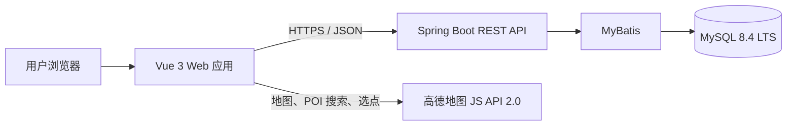

# YukiTrail 项目立项与开发规划

> 规划旅程，留下足迹。

| 项目项 | 内容 |
| --- | --- |
| 正式名称 | YukiTrail |
| 仓库名称 | `yukitrail` |
| 项目定位 | 旅行规划与足迹分享平台 |
| 当前阶段 | 阶段一：项目立项与开发准备 |
| 当前重点 | 用户账户、行程规划、高德地图 |
| 文档日期 | 2026-08-26 |

## 1. 项目初衷

YukiTrail 希望为旅行者提供一个统一的空间，用来规划旅程、整理每日行程，并在旅行结束后留下记录。随着项目发展，用户还可以公开自己的旅行计划与旅行经历，在社区中获得灵感、交流经验。

项目名称中的 **Trail** 同时表达了“旅行路线”和“旅行足迹”；**YukiTrail** 则作为完整品牌名，保持简短、易识别，并为未来从行程规划扩展到旅行记录与社区分享预留空间。

当前项目以“学习兼作品集”为目标：既覆盖一个完整全栈项目的主要开发流程，也主动控制首版范围，避免在基础功能尚未稳定前引入过多复杂基础设施。

## 2. 目标用户与核心价值

### 2.1 目标用户

- 希望在出发前按日期整理景点和活动的旅行者。
- 希望在地图上直观看到每日地点分布的用户。
- 希望将自己的旅行计划长期保存，并在未来进行分享的用户。
- 需要从其他旅行者的计划和经历中获得灵感的用户。

### 2.2 核心价值

1. **计划集中管理**：旅行日期、地点、时间与备注集中在一份计划中。
2. **日程清晰可见**：按天组织行程，减少零散笔记带来的混乱。
3. **地图辅助规划**：通过地点搜索、选点和标记理解每日地点分布。
4. **从规划自然延伸到分享**：未来可以直接将已有计划转化为旅行记录或社区内容。

## 3. 产品范围

### 3.1 长期产品愿景

YukiTrail 的长期能力由三个部分组成：

- **旅行计划**：创建旅行、按日期编排行程、使用地图选择地点。
- **旅行记录**：记录旅途中的文字、图片和旅行瞬间。
- **旅行社区**：公开计划或游记，浏览、收藏和互动。

### 3.2 首版 MVP 目标

首版只完成一个最小但完整的使用闭环：

```text
注册或登录
    ↓
创建旅行计划
    ↓
设置旅行日期
    ↓
按天添加地点、时间和备注
    ↓
在地图上查看每日地点标记
    ↓
保存并再次打开计划
```

### 3.3 MVP 包含的功能

#### 用户账户

- 使用邮箱和密码注册。
- 登录并获取访问令牌。
- 在访问令牌失效后刷新会话。
- 主动退出并使刷新会话失效。
- 用户只能访问和修改自己的旅行计划。

#### 旅行计划

- 创建、查看、编辑和删除旅行计划。
- 设置计划标题、目的地、开始日期和结束日期。
- 在计划列表中查看自己的全部旅行计划。
- 根据日期范围生成每日行程。
- 修改日期范围时明确提示会受影响的已有日程，不允许静默删除。

#### 每日行程

- 按天查看行程。
- 添加、编辑和删除行程项。
- 记录开始时间、结束时间、地点、地址和备注。
- 通过拖动调整行程顺序，并将新顺序持久化到数据库。
- 时间可以留空，以支持尚未确定具体时间的地点。

#### 高德地图

- 使用高德地图 JS API 2.0 显示地图。
- 搜索 POI 并选择地点。
- 支持点击地图选点。
- 保存地点名称、地址、高德 POI ID 和经纬度快照。
- 在每日行程地图中按照行程顺序显示编号标记。
- 点击列表项时定位对应标记，点击标记时突出对应列表项。
- 地图服务不可用时允许手动填写地点和地址；缺少坐标的行程项仍可保存。

### 3.4 MVP 明确不包含的功能

以下内容不在首版实现，不提前创建占位页面、接口或数据表：

- 旅行帖子、游记和旅行瞬间。
- 点赞、评论、关注、收藏和通知。
- 公开主页、计划分享和社区推荐流。
- 图片或视频上传。
- AI 行程推荐、自动生成计划。
- 驾车、步行、公交路线规划和智能路线优化。
- Redis、消息队列、搜索引擎、微服务和 Kubernetes。

## 4. 页面规划

| 页面 | 主要职责 | 关键状态 |
| --- | --- | --- |
| 注册页 | 邮箱、密码和昵称注册 | 表单校验、邮箱重复、注册成功 |
| 登录页 | 邮箱密码登录 | 登录失败、会话过期、登录成功跳转 |
| 旅行计划列表页 | 展示、创建和删除自己的计划 | 空列表、加载失败、删除确认 |
| 旅行计划创建页 | 设置标题、目的地和日期范围 | 日期范围校验、保存失败 |
| 行程编辑页 | 按日期管理行程项 | 日期切换、拖动排序、未保存状态 |
| 行程地图区 | 搜索、选点和显示编号标记 | 地图加载失败、无坐标地点、列表联动 |

首版使用响应式 Web 页面，同时支持桌面浏览器和常见移动端宽度；不开发原生 App 或小程序。

## 5. 技术栈

### 5.1 前端

| 技术 | 用途 |
| --- | --- |
| Vue 3 | 构建单页应用和组件化界面 |
| TypeScript | 提供类型约束，减少接口字段使用错误 |
| Vite | 开发服务器与前端构建 |
| Vue Router | 页面路由和登录访问控制 |
| Pinia | 用户会话与跨页面状态管理 |
| Element Plus | 表单、日期、弹窗、提示和基础布局组件 |
| Axios | 调用后端 REST API |
| 高德地图 JS API 2.0 | 地图展示、POI 搜索、选点和标记 |
| Vitest | 前端单元测试和组件测试 |
| Playwright | 关键用户流程的端到端测试 |

前端开发环境统一使用 **Node.js 22.12+** 和 **npm**。项目不需要服务端渲染，因此采用 Vue + Vite 的 SPA 方案。

### 5.2 后端

| 技术 | 用途 |
| --- | --- |
| Java 21 | 后端运行环境 |
| Spring Boot 4.1.x | Web 应用基础框架 |
| Maven | 依赖管理、构建和测试 |
| Spring Web | REST API |
| Spring Validation | 请求参数校验 |
| Spring Security | 认证、授权和密码保护 |
| JWT | 短期访问令牌 |
| MyBatis Spring Boot Starter 4.x | 数据访问与 SQL 映射 |
| Flyway | 数据库结构版本管理 |
| JUnit 5 / Spring Boot Test | 后端单元与集成测试 |
| Testcontainers | 使用真实 MySQL 进行集成测试 |

### 5.3 数据库与本地环境

| 技术 | 决策 |
| --- | --- |
| MySQL 8.4 LTS | 保存用户、会话、旅行计划和每日行程 |
| Docker Compose | 在本地启动 MySQL，统一数据库版本与配置 |
| Windows 本机 | 直接运行 Vue 和 Spring Boot，方便使用 IDE 调试 |

### 5.4 版本选择依据

- [Vue 官方快速开始](https://vuejs.org/guide/quick-start.html)：Vue 官方当前要求 Node.js `^20.19.0` 或 `>=22.12.0`，无 SSR 需求时可以直接使用 Vite。
- [Spring Boot 系统要求](https://docs.spring.io/spring-boot/system-requirements.html)：Spring Boot 4.1.x 支持 Java 17 及以上版本，项目选择 Java 21 LTS。
- [MyBatis Starter 兼容表](https://mybatis.org/spring-boot-starter/mybatis-spring-boot-autoconfigure/)：MyBatis Spring Boot Starter 4.x 对应 Spring Boot 4.x。
- [MySQL LTS 说明](https://dev.mysql.com/doc/refman/8.4/en/mysql-releases.html)：项目使用 MySQL 8.4 LTS，优先获得稳定行为和长期支持。
- [高德地图 JS API 2.0](https://lbs.amap.com/api/javascript-api-v2/summary/)：用于首版地图渲染、地点搜索和标记。

项目允许在同一主版本内升级补丁版本，但跨主版本升级必须先验证兼容性。

## 6. 系统架构



### 6.1 请求流转

以“创建一个行程项”为例：

1. 用户在 Vue 页面中填写时间、地点与备注。
2. Vue 将表单转换为 JSON，通过 `/api/v1` 调用 Spring Boot。
3. Controller 完成请求接收与参数校验。
4. Service 校验旅行计划归属和业务规则。
5. Mapper 通过 MyBatis 执行 SQL。
6. MySQL 保存数据后，后端返回统一响应结构。
7. Vue 更新行程列表，并根据地点坐标更新地图标记。

高德地图只负责地图与地点能力，不作为 YukiTrail 行程数据的持久化来源。用户确认地点时，系统会保存一份地点快照。

## 7. 规划中的仓库结构

本阶段不创建下面的代码目录；它们是后续工程初始化时采用的目标结构。

```text
yukitrail/
├─ apps/
│  ├─ web/                   # Vue 3 + TypeScript 前端
│  └─ api/                   # Spring Boot + MyBatis 后端
├─ docs/                     # 产品、接口和开发文档
├─ infra/                    # Docker Compose 等本地基础设施
├─ PROJECT_PLAN.md           # 当前立项与开发规划
├─ README.md                 # 后续添加的项目入口说明
└─ .gitignore                # 后续初始化时添加
```

## 8. API 约定

### 8.1 基础约定

- REST API 统一使用前缀 `/api/v1`。
- 请求和响应使用 JSON，字段使用 `camelCase`。
- 数据库表名和列名使用 `snake_case`。
- 成功与失败都使用统一响应结构，同时保留正确的 HTTP 状态码。
- `traceId` 用于定位一次请求，不向客户端返回内部异常堆栈。

```json
{
  "code": "OK",
  "message": "success",
  "data": {},
  "traceId": "01JYUKITRAIL00000000000000"
}
```

### 8.2 接口分组

| 方法与路径 | 用途 |
| --- | --- |
| `POST /api/v1/auth/register` | 邮箱注册 |
| `POST /api/v1/auth/login` | 登录并签发访问令牌与刷新会话 |
| `POST /api/v1/auth/refresh` | 使用刷新 Cookie 获取新访问令牌 |
| `POST /api/v1/auth/logout` | 撤销当前刷新会话 |
| `GET /api/v1/trips` | 查询当前用户的旅行计划 |
| `POST /api/v1/trips` | 创建旅行计划 |
| `GET /api/v1/trips/{tripId}` | 查看旅行计划详情 |
| `PATCH /api/v1/trips/{tripId}` | 修改旅行计划 |
| `DELETE /api/v1/trips/{tripId}` | 删除旅行计划 |
| `GET /api/v1/trips/{tripId}/days` | 查询旅行计划的每日行程 |
| `POST /api/v1/days/{dayId}/items` | 添加行程项 |
| `PATCH /api/v1/days/{dayId}/items/{itemId}` | 修改行程项 |
| `DELETE /api/v1/days/{dayId}/items/{itemId}` | 删除行程项 |
| `PUT /api/v1/days/{dayId}/items/order` | 持久化当日行程项顺序 |

接口实现时必须在后端校验资源归属。知道其他用户的 `tripId`、`dayId` 或 `itemId`，不代表拥有访问权限。

## 9. 身份认证与安全边界

- 密码只保存经过 Spring Security 密码编码器处理的哈希值，不保存或记录明文密码。
- 访问令牌采用 Bearer JWT，建议默认有效期为 15 分钟。
- 刷新令牌通过 `HttpOnly`、`SameSite` Cookie 发送，生产环境启用 `Secure`。
- 刷新令牌建议默认有效期为 30 天；数据库只保存其哈希值。
- 每次刷新可以轮换刷新令牌，退出登录或检测到异常时可以撤销会话。
- 前端不得把刷新令牌写入 `localStorage`。
- 高德地图密钥、数据库密码和 JWT 私钥或密钥均通过环境变量或本地配置注入。
- 仓库只提交 `.env.example` 一类示例文件，不提交真实密钥。
- 高德 Web 端密钥必须配置允许使用的域名，并分别管理开发与生产配置。

## 10. 核心数据模型

| 模型 | 职责 | 关键数据 |
| --- | --- | --- |
| `User` | 用户账户 | 邮箱、密码哈希、昵称、创建时间 |
| `AuthSession` | 可续期且可撤销的登录会话 | 用户、刷新令牌哈希、过期时间、撤销时间 |
| `Trip` | 一次完整旅行 | 所属用户、标题、目的地、开始日期、结束日期 |
| `TripDay` | 旅行中的某一天 | 所属旅行、日期、天数序号、备注 |
| `ItineraryItem` | 某一天中的一个活动或地点 | 时间、标题、备注、排序值、地点快照 |
| `PlaceSnapshot` | 创建行程项时保存的地点信息 | 供应商、POI ID、名称、地址、经度、纬度 |

`PlaceSnapshot` 是 `ItineraryItem` 的组成部分，而不是首版中独立维护的地点主数据。即使高德中的地点名称或地址以后发生变化，已经保存的旅行计划仍然可以正常显示原始内容。

### 10.1 关键业务规则

- `Trip` 的结束日期不得早于开始日期。
- 创建或调整日期范围时，系统按日期维护对应的 `TripDay`。
- 缩短日期范围会影响已有行程时，必须先展示影响并由用户明确确认。
- `ItineraryItem` 的时间为可选；同时填写开始和结束时间时，结束时间不得早于开始时间。
- 同一天中的行程项使用独立排序值，排序更新必须作为一次完整操作保存。
- 地点名称允许手动填写；高德 POI ID 和坐标允许为空。
- 首版所有旅行计划均为私有数据。

## 11. 本地开发与配置准备

后续开始搭建工程前，需要准备：

- Java 21 与 Maven。
- Node.js 22.12+ 与 npm。
- Docker Desktop 和 Docker Compose。
- 高德开放平台 Web 端开发密钥及安全配置。
- Git 与常用 IDE；前端可使用 VS Code，后端可使用 IntelliJ IDEA 或 VS Code。

计划中的环境变量包括：

```text
# Web
VITE_API_BASE_URL
VITE_AMAP_KEY
VITE_AMAP_SECURITY_JS_CODE

# API / Database
DB_HOST
DB_PORT
DB_NAME
DB_USERNAME
DB_PASSWORD
JWT_PRIVATE_KEY
JWT_PUBLIC_KEY
```

变量名称可以在工程初始化时根据具体 JWT 实现微调，但“真实值只存在于本地或部署环境中”的规则不变。

## 12. Git 协作约定

- 默认稳定分支为 `main`。
- 每个开发任务使用短期 `feature/*` 分支，例如 `feature/trip-crud`。
- 提交前依次检查 `git status`、`git diff` 和测试结果。
- 提交只包含当前任务相关文件，不提交密钥、构建产物或 IDE 私有缓存。
- 功能通过检查后再合并到 `main`，不长期维护不必要的中间分支。

## 13. 开发里程碑

| 阶段 | 目标 | 完成标志 |
| --- | --- | --- |
| 1. 工程骨架与环境 | 创建前后端、数据库和基础配置 | 前端、后端、MySQL 均可启动，健康检查通过 |
| 2. 账户认证 | 完成注册、登录、刷新和退出 | 会话可刷新和撤销，受保护接口可识别用户 |
| 3. 旅行计划 CRUD | 完成旅行计划和日期范围管理 | 用户可管理自己的计划，无法访问他人计划 |
| 4. 每日行程 | 完成按天编排和拖动排序 | 行程项增删改查与顺序均能持久化 |
| 5. 高德地图联动 | 完成搜索、选点和编号标记 | 地图和行程列表双向联动，失败时可手动录入 |
| 6. 测试与作品集展示 | 完善测试、响应式布局和说明文档 | 核心流程自动化测试通过，可稳定演示 |
| 7. 社区阶段 | 开始旅行记录与公开分享 | 单独设计并评审社区范围后再实施 |

## 14. 后续验收场景

### 14.1 用户与会话

- 使用有效邮箱可以注册，重复邮箱会收到明确提示。
- 密码错误时登录失败，不泄露账户是否存在等敏感细节。
- 访问令牌过期后可以通过有效刷新会话续期。
- 退出后原刷新会话不能再次使用。
- 用户无法读取、修改或删除其他用户的旅行计划。

### 14.2 旅行计划

- 可以创建有效日期范围的旅行计划，并生成对应的每日行程。
- 结束日期早于开始日期时，前后端都拒绝请求。
- 修改日期范围不会静默删除已有行程。
- 删除旅行计划前必须确认；删除后相关每日行程不再可访问。

### 14.3 每日行程与地图

- 行程项可以添加、修改、删除并在刷新页面后保持一致。
- 拖动排序后刷新页面，顺序仍然正确。
- POI 搜索成功后，名称、地址、POI ID 和坐标可以保存。
- 地图搜索失败时，用户仍可手动填写地点并保存。
- 地图密钥缺失或加载失败时显示明确状态，不导致整个编辑页崩溃。
- 有坐标和无坐标的行程项可以同时存在；地图只标记有坐标的项目。
- 桌面端和常见移动端宽度下，表单、行程列表与地图均可操作。

## 15. 风险与控制方式

| 风险 | 控制方式 |
| --- | --- |
| MVP 范围持续扩大 | 以本文件的“不包含功能”为边界，新功能先进入路线图 |
| 地图 API 配额或加载失败 | 限制首版地图能力，并保留手动地点录入 |
| 地图数据发生变化 | 保存地点快照，不在展示时强依赖实时 POI 数据 |
| 日期调整造成数据丢失 | 修改前计算影响范围并要求明确确认 |
| JWT 使用不当 | 使用短期访问令牌、HttpOnly 刷新 Cookie 和可撤销会话 |
| 本地环境不一致 | MySQL 固定使用 Docker Compose 与 8.4 LTS 版本线 |
| 密钥泄露 | 环境变量注入、提交前检查、限制高德密钥允许域名 |

## 16. 未来路线图

MVP 稳定后，按照以下顺序扩展：

1. **旅行记录**：在旅行计划基础上添加文字和图片记录。
2. **计划公开分享**：允许用户控制计划可见性并生成公开页面。
3. **社区互动**：帖子流、点赞、评论、关注、收藏和通知。
4. **搜索与推荐**：按目的地、标签或主题发现公开内容。
5. **AI 行程建议**：根据日期、地点和偏好生成建议，由用户确认后写入计划。
6. **路线能力**：评估驾车、步行和公交路线展示，以及路线顺序优化。

每个扩展阶段都需要单独确认产品边界、数据模型和验收标准，不在 MVP 中提前创建无实现意义的占位代码。

## 17. 阶段一完成标准

本阶段在满足以下条件后视为完成：

- 项目名称、定位、目标用户和核心价值已经明确。
- MVP 包含与不包含的功能边界清晰。
- 前端、后端、数据库、地图和测试技术栈已经确定。
- 系统架构、仓库结构、接口分组和核心数据模型已有统一方向。
- 安全、密钥和本地开发方式已经记录。
- 后续里程碑和验收场景可以直接指导工程初始化与功能开发。

